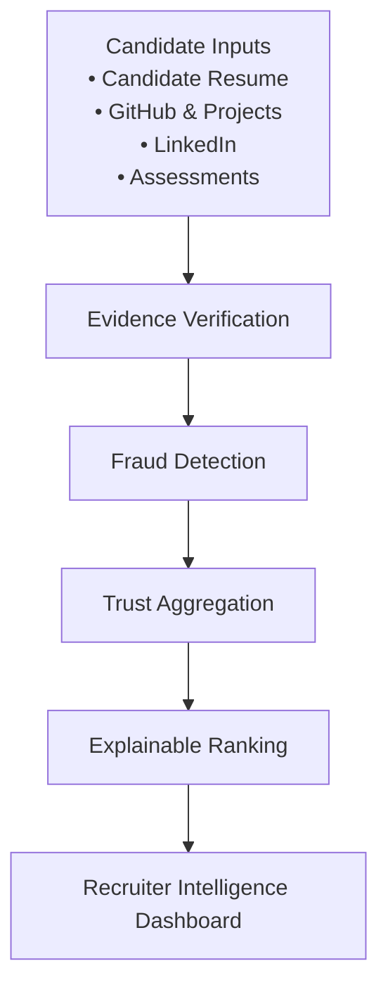

# TalentForge AI

**Evidence-Based Candidate Intelligence & Deterministic Ranking Engine**  
*Official Submission for the Redrob India Runs Data & AI Challenge*

---

## Executive Summary

**TalentForge AI** is an evidence-based evaluation pipeline designed to replace superficial ATS screening with verifiable engineering truth. Built for the **Redrob India Runs Data & AI Challenge**, it deterministically evaluates raw candidate profiles, cross-examines engineering claims against concrete signals, and outputs a reproducible top-100 candidate ranking backed by transparent audit reasoning.

### The Paradigm Shift

```text
Traditional ATS ──► Keyword Matching ──► Resume Inflation & Hiring Noise
                                                │
                                                ▼
Explainable Ranking ◄── Trust Aggregation ◄── Fraud Detection ◄── Evidence Verification ◄── TalentForge AI
```

---

## Problem

In today's engineering recruitment landscape, traditional ATS platforms rely heavily on surface-level keyword matching. This algorithmic flaw has created a systemic vulnerability to **resume inflation**, AI-generated buzzword stuffing, exaggerated metrics, and unverified project descriptions. As a result, hiring pipelines are saturated with severe hiring noise, penalizing authentic engineering talent while rewarding keyword optimization. 

**TalentForge AI** resolves this structural failure through **evidence-based verification**. Rather than trusting unverified text, our deterministic evaluation engine verifies engineering depth across concrete signals (career relevance, verified competence, skill matching, and leadership progression), executes multi-layer honeypot and padding fraud detection, and computes a mathematically rigorous trust score. Every ranked candidate is backed by explainable, audit-ready reasoning.

---

## Architecture Overview



---

## Quickstart & Judge Reproduction

This repository is optimized for instant verification by competition judges. The evaluation pipeline runs completely offline on standard CPU hardware with zero external dependencies during execution.

### 1. Setup Environment
```powershell
git clone https://github.com/Anub-356/TalentForge-AI.git
cd TalentForge-AI
python -m pip install -r requirements.txt
```

### 2. Reproduce Official Submission CSV
Run the canonical challenge command against the competition dataset:
```powershell
python rank.py --candidates "./dataset/inner_dataset/[PUB] India_runs_data_and_ai_challenge/India_runs_data_and_ai_challenge/candidates.jsonl" --out ./submission.csv
```

### 3. Instant Smoke Test (Out-of-the-box Sample)
To verify pipeline execution immediately without downloading the full challenge bundle, run against our checked-in sample dataset:
```powershell
python rank.py --candidates ./samples/sample_candidates.jsonl --out ./sample_submission.csv
```

### 4. Validate Submission
Run the official competition validator:
```powershell
python ".\dataset\inner_dataset\[PUB] India_runs_data_and_ai_challenge\India_runs_data_and_ai_challenge\validate_submission.py" .\submission.csv
```

---

## Repository Layout

```text
TalentForge-AI/
├── rank.py                     # Canonical deterministic ranking pipeline entrypoint
├── requirements.txt            # Minimal runtime Python dependencies
├── submission_metadata.yaml    # Official challenge metadata & declarative checklist
├── sandbox_demo.ipynb          # Interactive Google Colab / Jupyter demonstration
├── validation_scripts/         # Core evaluation engines
│   ├── ranking_engine.py       # Multi-phase scoring & min-heap selection engine
│   ├── features.py             # Feature extraction & signal normalization
│   └── honeypot_detector.py    # Resume padding & fraud detection engine
├── samples/                    # Checked-in sample candidate data & submission artifacts
├── docs/                       # Architectural & dataset documentation
├── backend/                    # Recruiter Intelligence FastAPI backend (Demo App)
└── frontend/                   # React / Tailwind interactive web application (Demo App)
```

---

## Recruiter Intelligence Demo App

While the competition ranking pipeline (`rank.py`) executes as a standalone offline script, we also provide a full-stack interactive demonstration web application for visualizing candidate rankings and evidence intelligence.

### Start Backend API
```powershell
python -m pip install -r backend/requirements.txt
python -m uvicorn backend.main:app --port 8000
```

### Start Frontend UI
```powershell
cd frontend
npm install
npm run dev
```
Open your browser to `http://localhost:3000` to explore the interactive dashboard.

---

## Key System Properties

- **100% Offline & Deterministic**: Zero network requests or LLM API calls during ranking execution; guarantees bit-for-bit reproducibility across runs.
- **Bounded Memory Execution**: Utilizes a highly efficient `O(N log K)` min-heap architecture (`K=100`) to stream massive candidate datasets without out-of-memory bottlenecks.
- **Explainable Audit Trail**: Every scored candidate includes transparent reasoning breakdowns explaining exactly why their evidence earned their ranking position.

---

## License & Compliance

Licensed under the MIT License. Developed explicitly as an original submission for the Redrob India Runs Data & AI Challenge. All code is original work with zero collusion.
