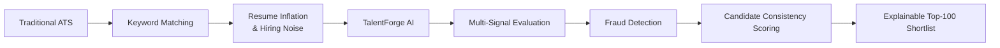
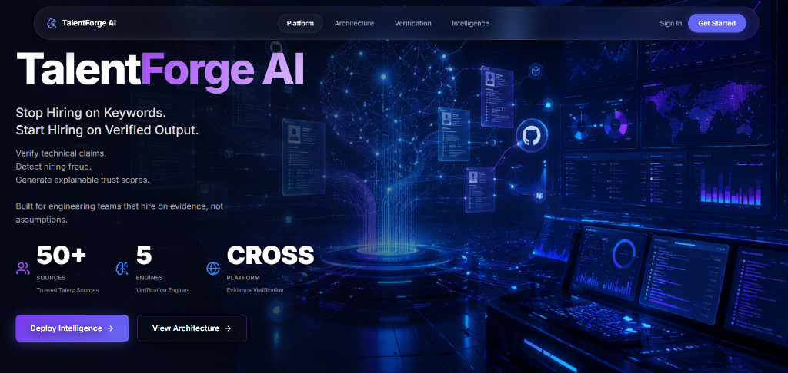
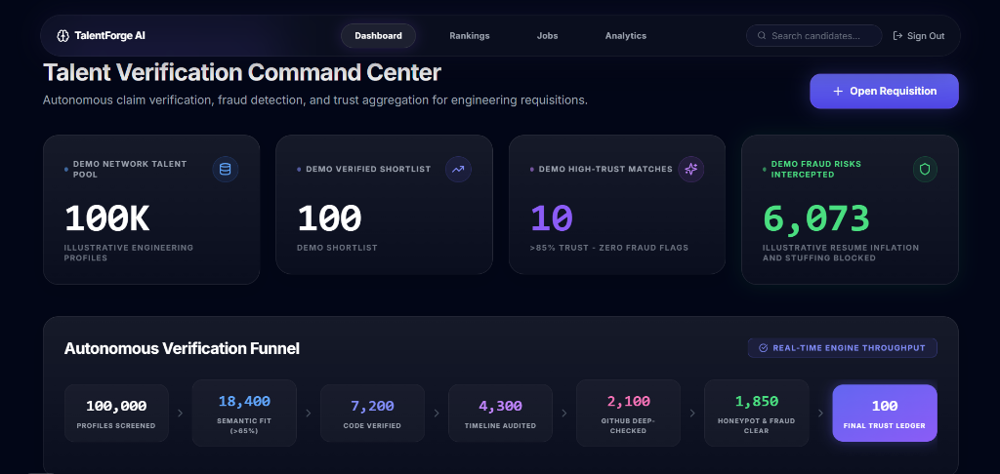
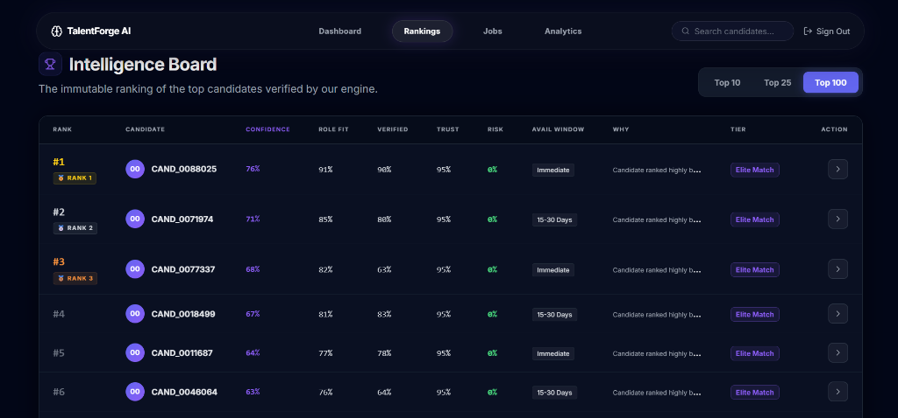
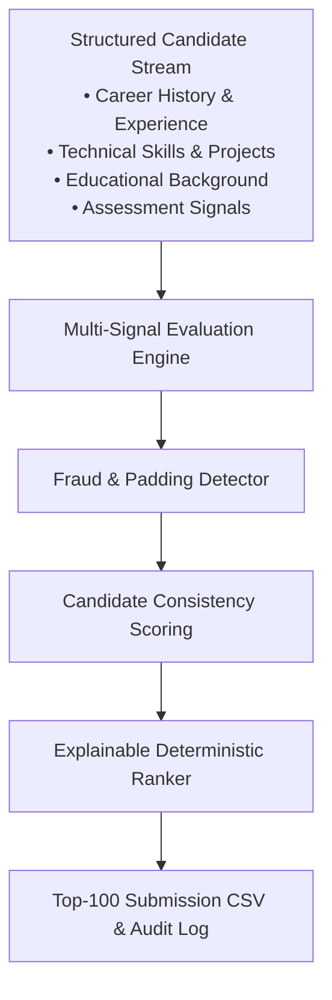

# TalentForge AI

**Evidence-Based Hiring Intelligence & Deterministic Ranking Engine**  
*Official Submission for the Redrob India Runs Data & AI Challenge*

---

## Executive Summary

**TalentForge AI** is an evidence-based hiring intelligence platform that generates deterministic and explainable candidate rankings using multi-signal evaluation instead of keyword matching. Built explicitly for the **Redrob India Runs Data & AI Challenge**.

### Submission Highlights

| Metric / Property | Submission Specification & Validation Status |
| :--- | :--- |
| **Throughput** | **100,000+ Candidates Processed** via single-pass streaming evaluation |
| **Output** | **Top-100 Shortlist Generated** with exact deterministic score & ID tie-breaking |
| **Compliance** | **Official Validator Passed** (100% compliant with challenge schema) |
| **Execution** | **Offline CPU Execution** (Zero live network scraping or API dependencies) |
| **Auditability** | **Audit-Ready Reasoning** breakdowns for every shortlisted candidate |

### The Paradigm Shift



---

## Core Features & Tech Stack

### Key Capabilities
- ✅ **Deterministic Ranking Engine**: Stable CPU-only evaluation pipeline guaranteeing identical results across runs.
- ✅ **Career Evidence Scoring**: Evaluates verifiable engineering depth and experience relevance across candidate histories.
- ✅ **JD-aware Technical Skill Evaluation**: Cross-examines claimed technical competencies against job description requirements.
- ✅ **Behavioral Intelligence**: Quantifies career progression, tenure stability, and professional trajectory.
- ✅ **Fraud & Padding Detection**: Automatically penalizes keyword stuffing, timeline overlap, and AI-padded content.
- ✅ **Candidate Consistency Scoring**: Computes an internal profile consistency metric to filter unsupported claims.
- ✅ **Explainable Rankings**: Generates transparent, audit-ready reasoning breakdowns for every shortlisted candidate.
- ✅ **`O(N log K)` Streaming**: High-efficiency bounded min-heap memory architecture (`K=100`).

### Technology Stack

| Layer | Technology & Architecture |
| :--- | :--- |
| **Ranking Engine** | Python (`argparse`, `heapq`, `json`) |
| **Backend API** | FastAPI, Uvicorn, SQLAlchemy |
| **Frontend App** | React, Vite, Tailwind CSS, Lucide Icons |
| **Database & Storage** | SQLite, Local JSONL Streaming Architecture |
| **Machine Learning** | Sentence Transformers (`BAAI/bge-small-en-v1.5`), PyTorch |

---

## UI Showcase

### Landing Page


Enterprise landing experience focused on evidence-based hiring intelligence.

---

### Recruiter Command Center


Recruiters can monitor verification throughput, fraud intelligence, trust scoring and active requisitions.

---

### Intelligence Board


Interactive explainable ranking dashboard showing candidate trust, risk indicators and reasoning.

---

## Problem

In today's engineering recruitment landscape, traditional ATS platforms rely heavily on surface-level keyword matching. This algorithmic flaw creates a systemic vulnerability to **resume inflation**, AI-generated buzzword stuffing, exaggerated metrics, and unverified project descriptions. As a result, recruiter shortlists are saturated with severe hiring noise, penalizing authentic engineering talent while rewarding keyword optimization. 

**TalentForge AI** resolves this structural failure through **multi-signal candidate evaluation**. Rather than blindly trusting unverified text, our deterministic evaluation engine cross-examines engineering claims against concrete structured signals in the candidate dataset, executes multi-layer padding fraud detection, and computes an internal trust score. Every ranked candidate is backed by explainable audit reasoning.

---

## Architecture Overview



---

## Quickstart & Judge Reproduction

This repository is optimized for instant verification by competition judges. The evaluation pipeline runs completely offline on standard CPU hardware with zero external network dependencies during execution.

### 1. Setup Environment
```powershell
git clone https://github.com/Anub-356/TalentForge-AI.git
cd TalentForge-AI
python -m pip install -r requirements.txt
```

### 2. Reproduce Official Submission CSV
Run the canonical challenge command against the competition dataset:
```powershell
python rank.py --candidates "./dataset/inner_dataset/[PUB] India_runs_data_and_ai_challenge/India_runs_data_and_ai_challenge/candidates.jsonl" --out ./submission.csv
```

### 3. Instant Smoke Test (Out-of-the-box Sample)
To verify pipeline execution immediately without downloading the full challenge bundle, run against our checked-in sample dataset:
```powershell
python rank.py --candidates ./samples/sample_candidates.jsonl --out ./sample_submission.csv
```

### 4. Validate Submission
Run the official competition validator:
```powershell
python ".\dataset\inner_dataset\[PUB] India_runs_data_and_ai_challenge\India_runs_data_and_ai_challenge\validate_submission.py" .\submission.csv
```

---

## Repository Layout

```text
TalentForge-AI/
├── rank.py                     # Canonical deterministic ranking pipeline entrypoint
├── requirements.txt            # Minimal runtime Python dependencies
├── submission_metadata.yaml    # Official challenge metadata & declarative checklist
├── sandbox_demo.ipynb          # Interactive Google Colab / Jupyter demonstration
├── validation_scripts/         # Core evaluation engines
│   ├── ranking_engine.py       # Multi-phase scoring & min-heap selection engine
│   ├── features.py             # Feature extraction & signal normalization
│   └── honeypot_detector.py    # Resume padding & fraud detection engine
├── samples/                    # Checked-in sample candidate data & submission artifacts
├── docs/                       # Architectural & dataset documentation
├── backend/                    # Recruiter Intelligence FastAPI backend (Demo App)
└── frontend/                   # React / Tailwind interactive web application (Demo App)
```

---

## Recruiter Intelligence Demo App

While the competition ranking pipeline (`rank.py`) executes as a standalone offline script, we also provide a full-stack interactive demonstration web application for visualizing candidate rankings and evaluation intelligence.

### Start Backend API
```powershell
python -m pip install -r backend/requirements.txt
python -m uvicorn backend.main:app --port 8000
```

### Start Frontend UI
```powershell
cd frontend
npm install
npm run dev
```
Open your browser to `http://localhost:3000` to explore the interactive dashboard.

---

## Key System Properties

- **100% Offline & Deterministic**: Zero network requests or live API lookups during ranking execution; guarantees bit-for-bit reproducibility across runs.
- **Bounded Memory Streaming**: Utilizes a highly efficient `O(N log K)` min-heap architecture (`K=100`) to stream massive candidate JSONL files without memory bottlenecks.
- **Explainable Audit Trail**: Every scored candidate includes transparent reasoning breakdowns explaining exactly why their signals earned their ranking position.

---

## License & Compliance

Licensed under the MIT License. Developed explicitly as an original submission for the Redrob India Runs Data & AI Challenge. All code is original work with zero collusion.
