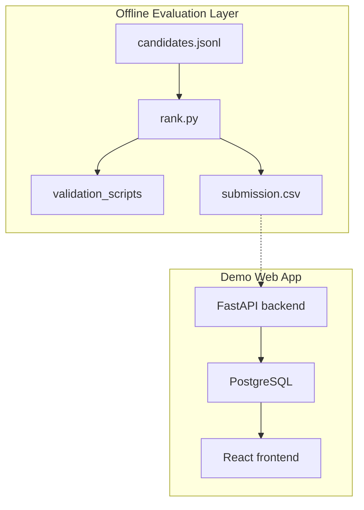

# TalentForge AI System Architecture

TalentForge AI separates the offline ranking submission from the demo web app.

Key points:

1. `rank.py` streams the released JSONL file and keeps the top 100 candidates in bounded memory.
2. Ranking ties are deterministic and resolved by `candidate_id` ascending.
3. The demo app uses seeded and illustrative UI data and is separate from the submission CSV.
